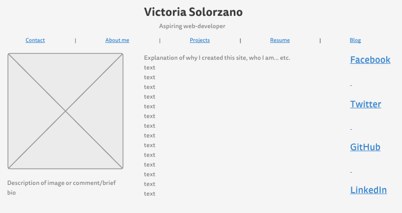
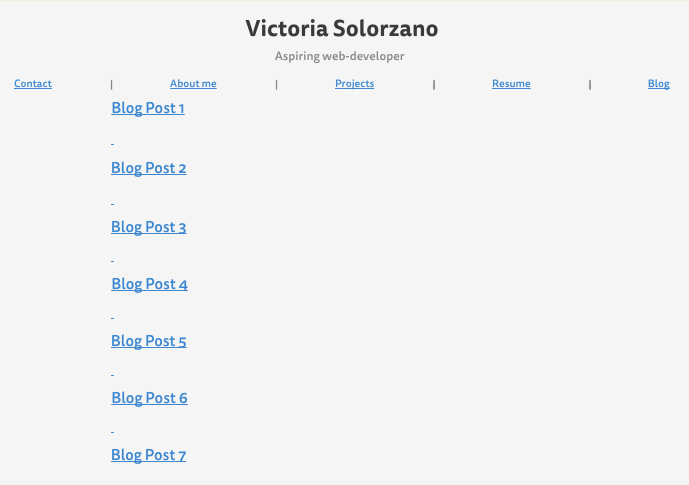

What is a wireframe?

A wireframe is a basic structure (no color, images, etc.) of a website to visually display the layout of the content, links, images.

What are the benefits of wireframing?

Quickly see what the basic design will look like, at later stages will have the basic structure layed out to make the coding more straightforward, helps to improve the site navigation without use of color.

Did you enjoy wireframing your site?

Not particularly, was kind of boring.

Did you revise your wireframe or stick with your first idea?

I did end up going back a couple times to update a few things I didn't like at first.

What questions did you ask during this challenge? What resources did you find to help you answer them?

I didn't know how to create the structure for the wireframe, so I utilized one of the linked websites for building wirestructures: https://gomockingbird.com/

Which parts of the challenge did you enjoy and which parts did you find tedious?

I wasn't a huge fan of the wireframing process. I think it might feel more useful in the real world, when there are more structured pages that need to be viewed etc.