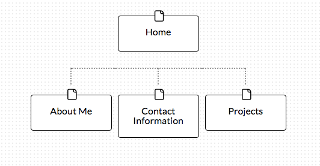

What are the 6 Phases of Web Design?

1. Information Gathering
2. Planning
3. Design
4. Development
5. Testing and Delivery
6. Maintenance

What is your site's primary goal or purpose?

The site's primary goal is to provide information about myself and the projects I am working on to potential employers.

What kind of content will your site feature?

My site will include biographical information about myself, my contact information, as well as the projects that I work on while attending DBC.

What is your target audience's interests and how do you see your site addressing them?

My target audience (potential employers) interests are finding good employees with skills in the areas that their company is currently looking for. My projects section should highlight my abilities for this need of the employer. Also, I think most companies want to find someone who will be a good fit with their company culture, and the About Me section should help them get to know me a bit better.

What is the primary "action" the user should take when coming to your site? Do you want them to search for information, contact you, or see your portfolio? It's ok to have several actions at once, or different actions for different kinds of visitors.

The primary action would be viewing my portfolio, followed by contacting me if there is interest in my work.

What are the main things someone should know about design and user experience?

I think the main things someone should know about design is that the goal is to make something asthetically pleasing as well as easy to interface with. User experience is about focusing on how the customer feels about the site and how they use it. While website content is important, design is equally important to get the content read and understood.

What is user experience design and why is it valuable?

User experience design is a method of focusing the attention on how a website is setup and displayed to make it more appeasing and easy to use for the person viewing the site . It is valuable because the easier and more enjoyable a website is to use, the more likely you are to get more frequent customers and more frequent use. It can translate into more hits or sales.

Which parts of the challenge did you find tedious?

I found the creating of the Site Map to be rather tedious. Mainly just the part of having to set-up an account.