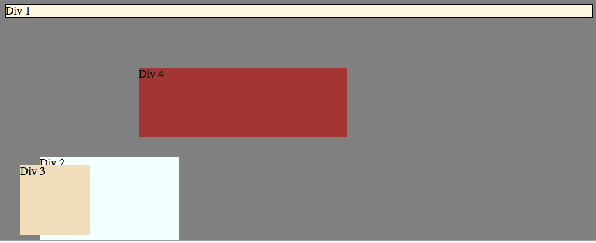
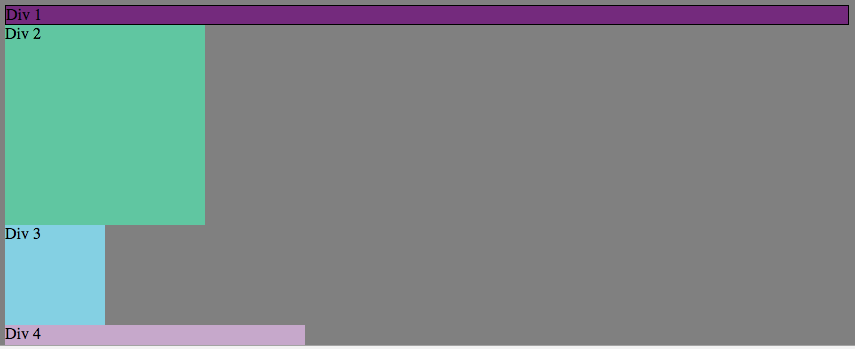
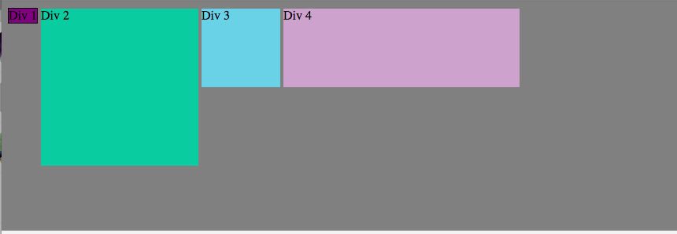
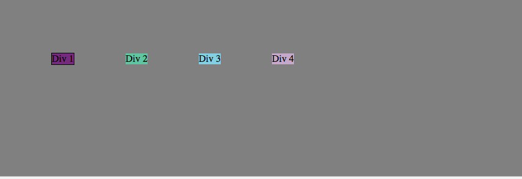
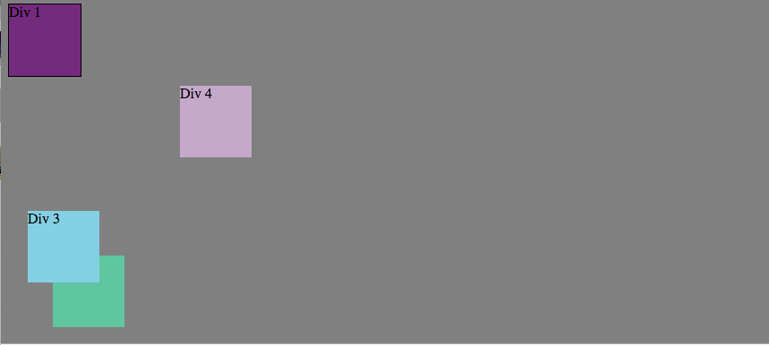
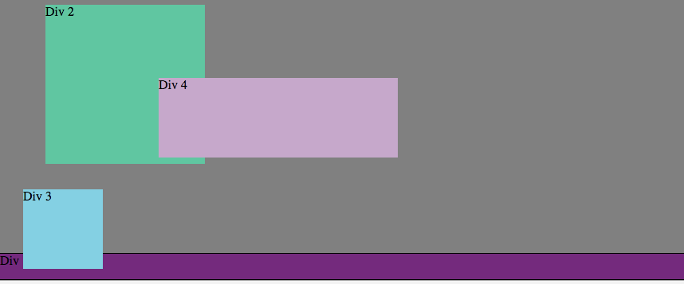
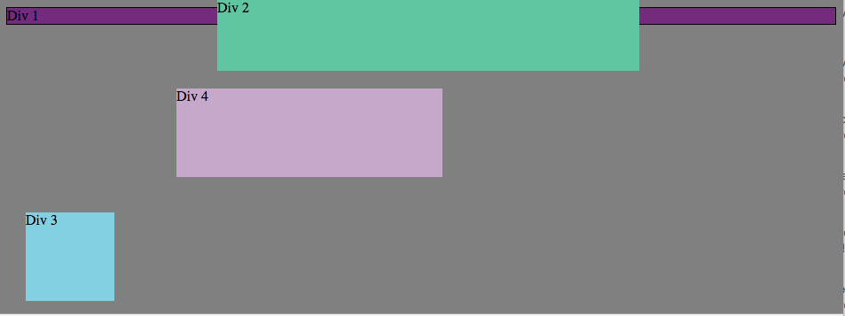
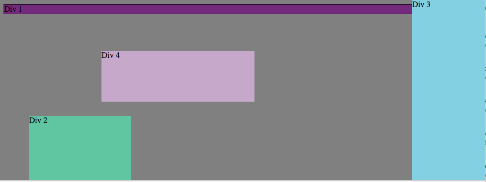
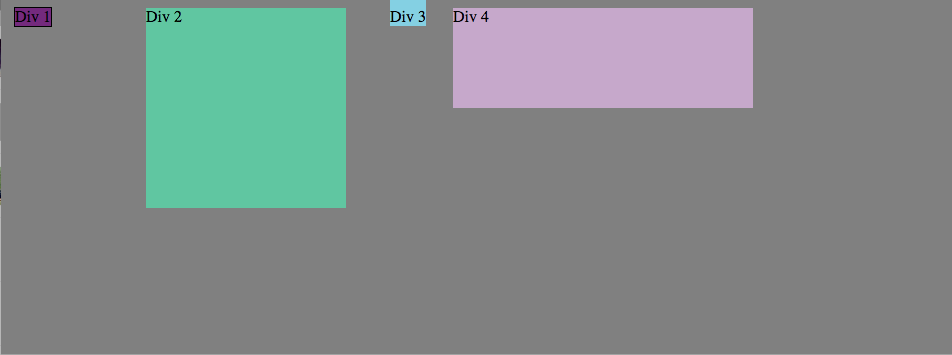

Exercise 1

Exercise 2

Exercise 3

Exercise 4

Exercise 5

Exercise 6

Exercise 7

Exercise 8

Exercise 9

- How can you use Chrome's DevTools inspector to help you format or position elements?

  - You can use Chrome's DevTools inspector to temporarily change some CSS within the HTML file to quickly test how changes affect the layout and formatting. It is much easier and quicker to see immediately how changes affect the document, as opposed to making a change to the stylesheet, saving, viewing changes, etc. This also allows you to test out the changes before actually modifying your actual stylesheet and potentially have to revert back to a previous version.

- How can you resize elements on the DOM using CSS?

  - You can resize elements on the DOM using the 'height' and 'width' properties.

- What are the differences between absolute, fixed, static, and relative positioning? Which did you find easiest to use? Which was most difficult?

  - Static position is the default and does not need to be declared. This puts the element in the place it would naturally fall in based on it's position in the html document. Absolute takes the element completely out of the flow, and positions it (based on left/right/top/bottom adjustments given) relative to the next parent element that is absolute or relative position (or the whole page if there is no parent element with relative or absolute position). Relative position leaves the object where it would normally fall based on a static position, but allows you to adjust it's location relative to where it would normally fall. Fixed position moves the object relative to the browser window itself, and does not move despite scrolling.

- What are the differences between margin, border, and padding?

  - The border is the edge of the rectangular block of an element, this can be given a style and color and be of any defined width. Margin is the space between the next element (or edge of the document) and the border. Padding is the space between the border and the content of the element itself.

- What was your impression of this challenge overall? (love, hate, and why?)

  - I liked this challenge, I thought it helped to show some of the differences that the different positioning properties has on the layout.