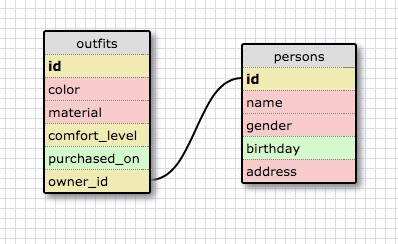

#1:

SELECT * FROM states;

#2:

SELECT * FROM regions;

#3:

SELECT state_name, population FROM states;

#4:

SELECT state_name, population FROM states ORDER BY population DESC;

#5:

SELECT state_name FROM states WHERE region_id = 7;

#6:

SELECT state_name, population_density
   ...> FROM states
   ...> WHERE population_density > 50
   ...> ORDER BY population_density ASC;

#7:

SELECT state_name
   ...> FROM states
   ...> WHERE population > 1000000 AND population < 1500000;

#8:

SELECT state_name, region_id
   ...> FROM states
   ...> ORDER BY region_id ASC;

#9:

SELECT region_name
   ...> FROM regions
   ...> WHERE region_name LIKE '%Central%';

#10:

SELECT regions.region_name, states.state_name
   ...> FROM states
   ...> INNER JOIN regions
   ...> ON states.region_id = regions.id
   ...> ORDER BY region_id ASC;s

Release 6: Your Own Schema

Release 7: Reflect

- What are databases for?

Databases are used to track large amounts of data that contain several different properties.

- What is a one-to-many relationship?

A one-to-many relationship describes two different groupings of data where each item in one group relates to many items from the other group. For example, you can have a group of authors and a group of books, each author can have written many books. (Note: Not every item in 'one' group has to link up with multiple items from the 'many' group.)

- What is a primary key? What is a foreign key? How can you determine which is which?

A primary key is a column that is unique to each entry in the table, in most cases this is an "id" column that increments up starting at 1 for each item in the table. A foreign key is a column in one table that references a unique key in another table. It is used to link items between two tables. A primary key will be unique for each item in the table and is usually a column called "id". A foreign key can be null or duplicated amongst several items in the table, it often ends in "_id".

- How can you select information out of a SQL database? What are some general guidelines for that?

You can use a command like:

SELECT * FROM table;

A better guideline for selecting data from a SQL database is to not use the "*" to pull all columns, specifically list out which columns you want displayed. Also, if you're not sure how much data is going to output, it is a good idea to use LIMIT to restrict the number of rows that will output.

