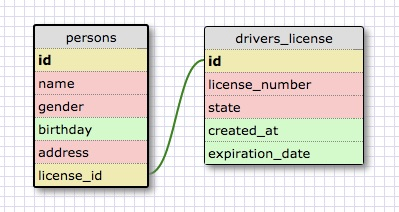
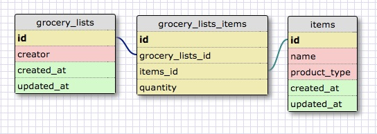

This is a one-to-one schema because each person can have only 1 (active) drivers license and each drivers license can only belong to 1 person. Just because you are a person, does not mean you necessarily have to have a drivers license though.

- What is a one-to-one database?

A one to one database is when two tables have entries where each entry only matches up to one (or none) of the entries in the other table.

- When would you use a one-to-one database? (Think generally, not in terms of the example you created).

You would use a one-to-one database if there is an option for the value to be null or empty.

- What is a many-to-many database?

A many to many database is where two tables have entries where each entry in one table can relate to many entries in the other table and vice versa.

- When would you use a many-to-many database? (Think generally, not in terms of the example you created).

You would use a many-to-many database when you want to relate the items between the two tables and add additional information about those specific instances when the two items are linked.

- What is confusing about database schemas? What makes sense?

I think the one-to-one relationship is difficult to see needing in practice when it wouldn't just be an additional column in your table. Both these schema make logical sense, will be interesting to see in practice.